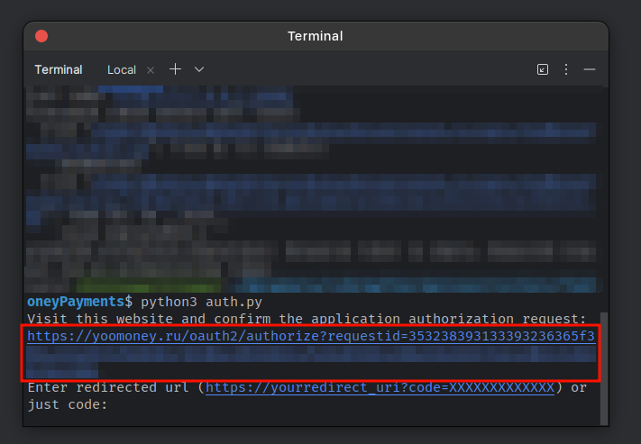

# YooMoney payments API

Гайд по выставлению счетов для уверенных в себе сухофруктов.

## 1. Получение токена
### 1.1. Создание приложения

Перейдите на страницу [создания приложения](https://yoomoney.ru/myservices/new) 
и создайте его с нужными вам параметрами.

__! Запомните redirect_uri, он нам ещё пригодится.__

### 1.2. Получение собственно токена =)

Вставьте в `config.py` свои значения `client_id` и `redirect_url`.

#### 1.2.1. Запустите `get_token.py`
#### 1.2.2. Перейдите по первой ссылке из консоли

#### 1.2.3. Подтвердите приложению доступ и вставьте ссылку, на которую вас перевело в терминал

#### 1.2.4. Получите токен и вставьте его в `config.py`

#### 1.2.5. Запустите `check_token.py`, чтобы убедиться в корректности токена

# 2. Выставление счетов

## 2.1. Просто выставление счетов.

Просто выставить счёт можно при помощи функции `invoice` (`payments.py`)

__Label необходим для последующей проверки транзакции по id__

## 2.2. Проверка оплаты.

Метод проверки оплаты реализован в `check_payment` (`payments.py`)

# (⁠◕⁠ᴗ⁠◕⁠✿⁠)

